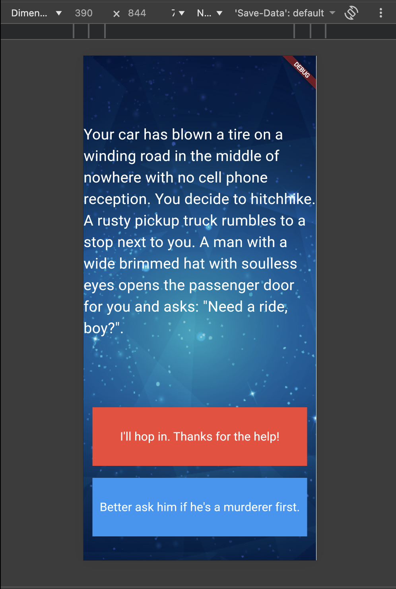

# flutter_application_destini

A new destini flutter project.

# Visual Demo:

  

## Reflection:

Since the udemy lesson was deprecated, I had to rely on Flutter resources sometimes. Readin the official documentation genuinely made me feel like a real developer. Huge thanks to the Flutter team because their documentation is incredibly well written and easy to find.

The way I code now feels like how a child learns to speak. What i mean is like i am trying everything, making mistakes, searching on google, and constantly checking the flutter docs. That process makes me feel motivated. This wasnt easy. I ran into many problems along the way. But in the end, i got it working.