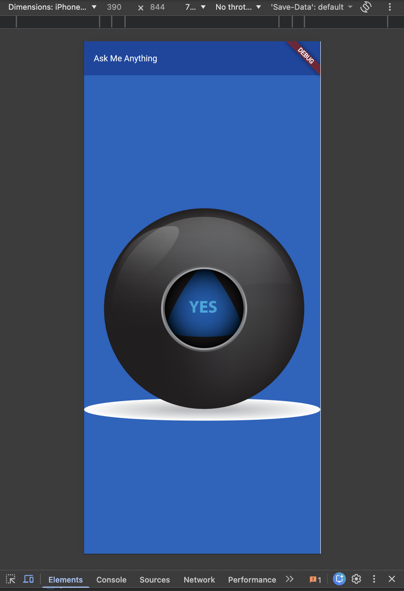

# flutter_application_magic_8_ball

A new magic 8 ball flutter project.

# Visual Demo:

  

This is "The Complete Flutter Development Bootcamp with Dart" Boss Level Challenge 1. Watching all the tutorials before doing boss level challenge was a bit wrong. Because watching all the code first and then writing it on my own experience is like watching a 'how to swim' tutorial on YouTube and then directly jumping into the sea. But I really loved the process of coding. This was a different project from what I used to do before; everything is so creative, I can do whatever I want, and it is free-spirited. I loved it and am keen to do the rest of them tomorrow. I hope this will motivate you to start something that you always wanted to try. See you next time.